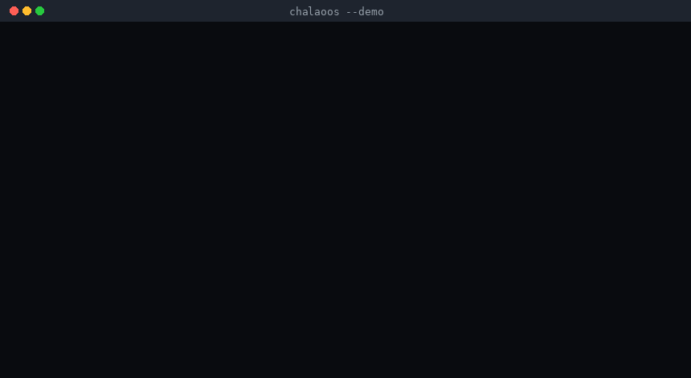
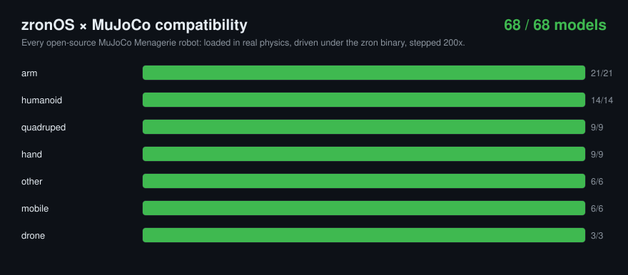
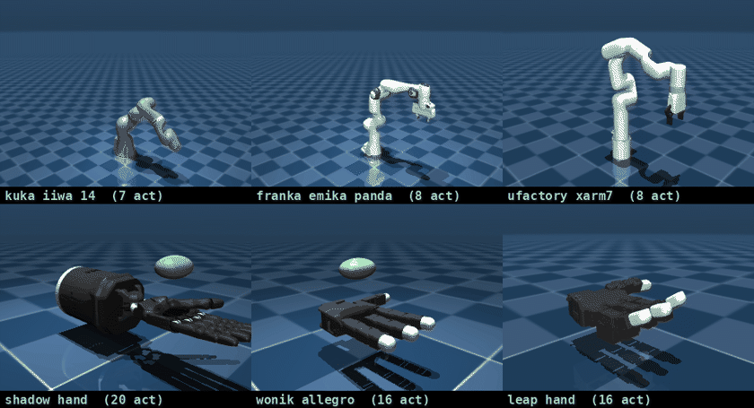
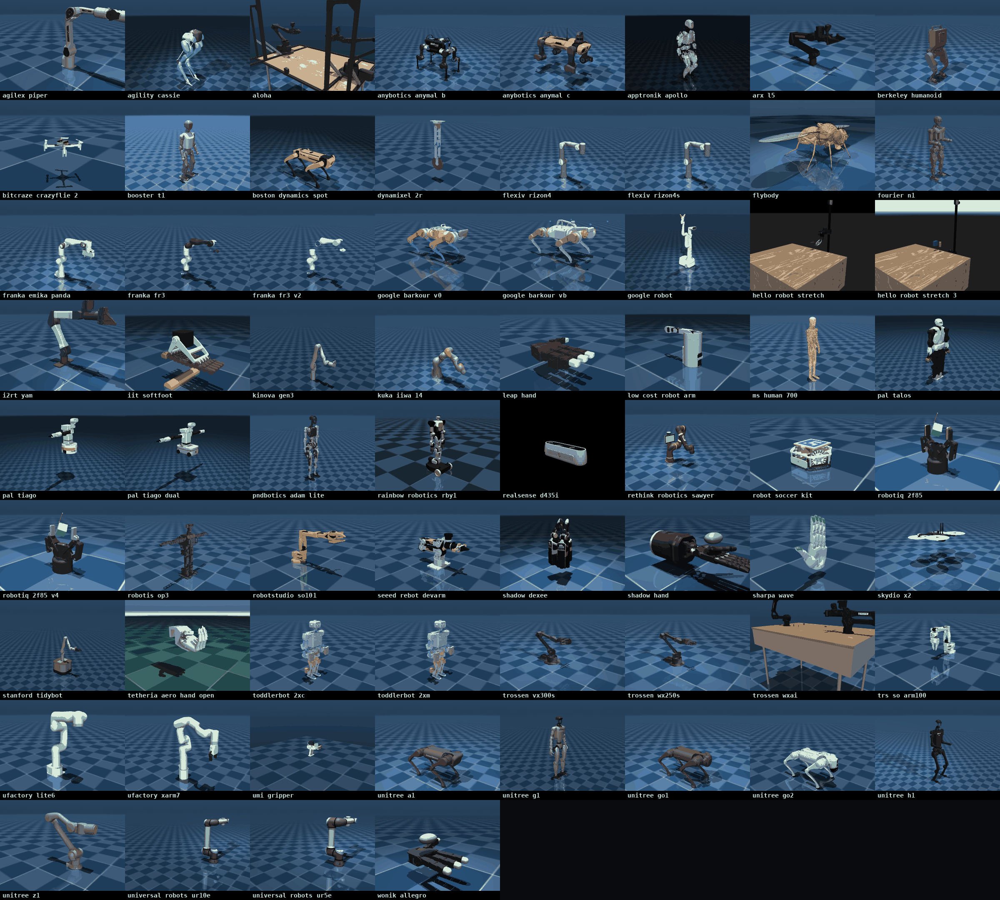
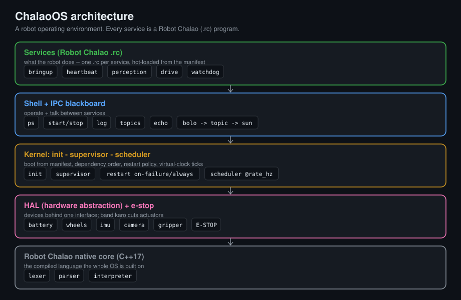

# zronOS

**A robot operating environment whose services are written in [Robot Chalao](https://github.com/megazron/robot-chalao) — the Hinglish robot language.** One manifest boots your whole robot: init, a service supervisor, a scheduler, a parameter server, a TF transform tree, an IPC blackboard, inter-service RPC, per-service health, bag record & replay, a hardware abstraction layer with an e-stop, and a shell. One binary, zero dependencies. Built on the Robot Chalao native C++ core.

<p align="center"></p>

<p align="center"><i>One command boots the robot: <code>zron demo</code>. Services start in dependency order, publish over the bus, and the watchdog trips the e-stop on low battery.</i></p>

```bash
make
./zron demo --seconds 8
```

## Validated on every open-source MuJoCo robot

zronOS ships a MuJoCo bridge and a compatibility harness. For **every** robot in the [MuJoCo Menagerie](https://github.com/google-deepmind/mujoco_menagerie) it loads the real model in physics, auto-generates a Robot Chalao service that drives that robot's actuators, boots it under the real `zron` binary, and steps the commanded setpoints through MuJoCo — checking the state stays finite.

<p align="center"></p>

<p align="center"><b>68 / 68</b> open-source Menagerie models — arms, quadrupeds, humanoids, hands, drones and mobile bases — boot and run under zronOS. See the full <a href="docs/compat.md">compatibility matrix</a>.</p>

<p align="center"></p>

<p align="center"><i>Real MuJoCo physics, driven live by the <code>zron</code> binary. Each robot's actuators follow the setpoints zron commands through the bridge — every joint you see move is a command from the runtime.</i></p>

### Every robot zronOS was tested on

<p align="center"></p>

<p align="center"><i>All 68 models, each loaded in real MuJoCo physics. Every one boots and runs under zronOS.</i></p>

```bash
# reproduce it yourself (needs Python + `pip install mujoco`)
git clone --depth 1 https://github.com/google-deepmind/mujoco_menagerie
python3 bridge/compat.py mujoco_menagerie ./zron docs
```

## What it is, and what it is not

zronOS is a robot **operating environment** — a runtime that boots a robot and keeps its programs alive — in the same sense that "ROS" (Robot Operating System) is a runtime, not a kernel. It is **not** a bare-metal OS kernel and does not replace Linux, and it is not a drop-in replacement for the whole ROS 2 ecosystem. What it gives you is the layer a robot actually needs on top of the OS, in one small, readable, dependency-free binary:

- **init + boot** from a single system manifest,
- a **supervisor** that starts services in dependency order and restarts them by policy,
- a **scheduler** that runs periodic services at their rate, with a **liveness watchdog**,
- a **parameter server** shared across services,
- a **TF transform tree** with correct 3D composition,
- an **IPC blackboard** for services to publish and read topics,
- **inter-service RPC** — one service calls another's function and gets the result,
- **per-service health / diagnostics** and a `doctor`,
- **bag record & replay** of the bus,
- a **HAL** (hardware abstraction layer) with an **e-stop** and fault injection,
- a **shell** to inspect and control the running system,

and the thing that makes it different: **every service is a Robot Chalao `.rc` program**, and the whole system is one readable manifest.

## Quick start

```bash
make                                  # -> ./zron   (g++ -std=c++17, no dependencies)
./zron demo                           # boot the bundled patrol robot, run a story, exit
./zron run system/system.manifest     # boot and drop into the interactive shell
./zron doctor system/system.manifest  # preflight checks (no boot)
./zron new mybot                      # scaffold a new robot (manifest + services)
```

## The runtime capabilities

Every capability below is a real, tested feature. `examples/capabilities.manifest` exercises all of them; `make test` asserts each one.

### Parameter server

A shared key/value store. One service sets, any other reads:

```
param set "max_speed" 0.5           # in one service
maano v = param get "max_speed"     # in another -> 0.5
```

### TF transform tree

Register frames with a parent and a 6-DOF transform; look up any frame in any other. The composition is real 3D math (rotation matrices, rigid inverse):

```
frame "base" "odom" (1, 0, 0, 0, 0, 0)
frame "arm"  "base" (0, 0, 0.5, 0, 0, 1.5708)
maano p = TF pucho "arm" se "odom"   # -> Pose(x=1.0, y=0.0, z=0.5, yaw=1.571)
```

### Inter-service RPC

A service advertises one of its functions as a service; another calls it and gets the return value:

```
# provider
kaam plan_speed(target)
  wapas target * 100
khatam
sewa do "plan_speed" plan_speed

# client
maano r = sewa bulao "plan_speed" 0.4
dikhao r.result                      # -> 40
```

### Health / diagnostics

A service reports its own health; the kernel adds a liveness check (a periodic service that misses its window degrades). `zron` aggregates it into a health report, and the shell has a `doctor`:

```
agar battery kitni hai < 20 toh
  sehat kharaab "battery critical"
warna
  sehat theek
khatam
```

### Record & replay

Record every message on the bus and replay it:

```
record shuru "run.bag"
# ... services publish ...
record band
```

## Boot demo

`./zron demo` boots the bundled patrol robot and runs a deterministic story: boot in dependency order, the scheduler ticking heartbeat / perception / drive, the battery draining through the HAL, the `watchdog` service tripping the **e-stop** when the battery gets low, the HAL then refusing to move the wheels, and a clean halt with a `ps` table, the topic bus, and a health report.

## Architecture



Each service gets its own Robot Chalao interpreter. Two hooks connect the language to the OS: an **output sink** routes every `dikhao`/sim line into the service's log, and a **robot-command hook** routes commands (`battery kitni hai`, `aage chalo`, `bolo`, `param set`, `frame`, `sewa`, `sehat`, `band karo`) into the HAL, the parameter server, the TF tree, the bus, RPC and the e-stop. Commands the OS doesn't intercept fall back to the language's built-in simulation.

## The manifest

`system/system.manifest` describes the robot. Each `[service ...]` block:

```ini
[service heartbeat]
script    = heartbeat.rc      # a Robot Chalao program
after     = bringup           # start after these services
rate_hz   = 2                 # run 2x/second (0 = run once at boot)
restart   = on-failure        # never | on-failure | always
autostart = true
```

## The MuJoCo bridge

`bridge/zron_mujoco.py` is a small, standalone physics backend. It loads any MuJoCo MJCF and speaks newline-delimited JSON, so a zronOS HAL (or the compatibility harness) can drive real physics for any robot:

```bash
python3 bridge/zron_mujoco.py path/to/scene.xml
{"cmd":"info"}                         # -> nu, nq, actuator names, ctrl ranges
{"cmd":"step","ctrl":[...],"n":100}    # -> step physics, report qpos + finite
```

The `zron` binary can also drive a model **live** — it forks the bridge, enumerates the actuators, runs a closed control loop with a stability governor, and prints a one-line verdict:

```bash
zron mujoco path/to/scene.xml --bridge "python3 bridge/zron_mujoco.py"
# {"ok":true,"stable":true,"nu":7,"nq":7,"cycles":200,"qvel_max":0.79,"t":2.0,...}
```

`bridge/compat.py` uses the bridge to validate zronOS against the whole Menagerie and writes [`docs/compat.md`](docs/compat.md).

## Shell

Run `./zron run` (or `./zron` with no args prints help) for an interactive shell after boot:

| command | does |
|---|---|
| `ps` | services, states, health, restarts, runs, uptime |
| `health` / `doctor` | aggregate health report |
| `topics` / `echo TOPIC` | list the bus / print a topic's last value |
| `params` / `tf` | dump the parameter server / the TF tree |
| `start` / `stop` / `restart NAME` | control a service |
| `log NAME` | recent output of a service |
| `tick [n]` | advance the virtual clock n steps |
| `fault NAME` / `clear` | inject / clear a HAL actuator fault |
| `estop` | assert the e-stop |
| `replay` | replay the recorded bus |
| `uptime` | clock + battery |
| `halt` | stop everything and exit |

## CLI

```bash
zron run <manifest>        boot a manifest and drop into the shell
zron demo [manifest]       boot and run a deterministic story, then exit
zron doctor <manifest>     preflight checks (no boot): parse, deps, cycles
zron new <name>            scaffold a new robot (manifest + services)
zron mujoco <model.xml>    drive a MuJoCo model live through the bridge (HITL)
zron --version | --help
```

## Build and test

```bash
make            # -> ./zron  (g++ -std=c++17, no dependencies)
make test       # boot, lifecycle, IPC, e-stop, restart, params, TF, RPC, health, doctor, scaffold
make san        # build with AddressSanitizer + UBSan
./zron demo --seconds 8
```

Requires only a C++17 compiler. No ROS, no external libraries. The MuJoCo bridge and compatibility harness additionally need Python and `pip install mujoco`.

## Relationship to Robot Chalao

zronOS embeds the **Robot Chalao native C++ core** (vendored in [`vendor/chalao/`](vendor/chalao/)). The language is the general-purpose way to program one robot; zronOS is the runtime that boots and supervises many Robot Chalao programs as one system. See the language at <https://github.com/megazron/robot-chalao>.

## Roadmap

- A live HAL backend that speaks to the MuJoCo bridge (or ROS 2 / serial) so the same manifest runs in physics and on hardware.
- Preemptive scheduling and per-service CPU/time budgets.
- Persistent parameters and a `sun` (subscribe) delivery path from the bus into services.
- A `journalctl`-style on-disk log store and a boot-time dependency-graph visualiser.

## License

MIT — see [LICENSE](LICENSE).
